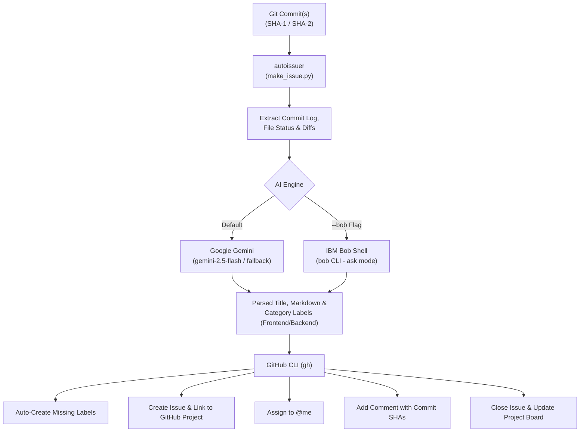

# autoissuer

An automated developer workflow tool that analyzes Git commits, generates structured GitHub Issues, categorizes changes using AI, links them directly to **GitHub Projects**, and closes the loop on resolved work.

Integrated with **Google Gemini** and **IBM Bob Shell** for intelligent commit summarization and categorization.

---

## Overview

Writing issue summaries and keeping GitHub Project boards in sync after completing work can be tedious. **`autoissuer`** streamlines this by inspecting one or more Git commits, extracting the diffs and file changes, and having an LLM generate:

1. **A concise, descriptive issue title**.
2. **A professional issue description** written in the imperative mood (3–5 bullet points).
3. **Automated category labels** (`Frontend`, `Backend`, or both).
4. **Direct integration with GitHub Projects** (v2 boards).
5. **Self-assignment & resolution comment** linking the exact commit SHAs and commit messages.
6. **Automatic issue closure**, moving the ticket into completed status on your project board.



---

## Features

- **Dual AI Provider Support**:
  - **Google Gemini**: Uses the official Google GenAI SDK (`gemini-2.5-flash`, `gemini-2.0-flash`, `gemini-flash-latest`) with automatic rate-limit backoff and fallback handling.
  - **IBM Bob Shell**: Native integration with IBM Bob (`bob --auth-method api-key --chat-mode ask -p`) via the `--bob` flag.
- **Smart Token & Diff Safeguards**: Automatically filters out binary assets, images, lockfiles, `vendor/`, and `node_modules/`, and truncates oversized diffs to prevent API token exhaustion.
- **Strict Output Formatting**: Enforces concise, imperative-mood summaries (e.g., *"Add authentication middleware"*, *"Fix token refresh bug"*) without redundant markdown headers or fluff.
- **GitHub Projects Integration**: Links issues directly to your active GitHub Project board via `gh project` commands.
- **Auto-Label Management**: Detects if `Frontend` or `Backend` labels exist on your repository and creates them with custom styling (`#5319e7`) if they are missing.
- **Interactive First-Time Setup**: Prompts for required configuration values (`GH_PROJECT`, `GEMINI_API_KEY`, `BOBSHELL_API_KEY`) on first run and persists them to `.env`.

---

## Prerequisites

Before using `autoissuer`, make sure you have the following installed:

1. **[Git](https://git-scm.com/)**
2. **[GitHub CLI (`gh`)](https://cli.github.com/)**
   - Make sure you are authenticated with both `repo` and `project` scopes:
     ```bash
     gh auth login
     # Or refresh existing token with required scopes:
     gh auth refresh -s repo,project
     ```
3. **[Python 3.9+](https://www.python.org/)** (with `venv`)
4. **API Keys / Credentials**:
   - **Gemini**: [Google AI Studio API Key](https://aistudio.google.com/)
   - **IBM Bob** *(optional, for `--bob` mode)*: [IBM Bob API Key](https://bob.ibm.com/admin/apikeys) (Inference scope) and `bob` CLI installed and available in your `PATH`.

---

## Installation and Setup

1. **Clone the Repository**:
   ```bash
   git clone https://github.com/cartoonhead32/autoissuer.git
   cd autoissuer
   ```

2. **Configure Environment Variables**:
   You can either let `autoissuer` prompt you interactively on your first run, or create a `.env` file in the project root:

   ```env
   # Title of your target GitHub Project (case-insensitive)
   GH_PROJECT="My Sprint Board"

   # Google Gemini API Key (Default)
   GEMINI_API_KEY="your-gemini-api-key"

   # IBM Bob Shell API Key (Optional, for --bob flag)
   BOBSHELL_API_KEY="your-bob-api-key"
   ```

3. **Install Dependencies** (if running Python directly):
   ```bash
   pip install google-genai
   ```
   *(Note: The provided `scripts/make-issue.sh` wrapper handles setting up a Python virtual environment and installing dependencies automatically).*

---

## Usage

### Using the Bash Script

The bash script handles virtual environment creation and runs the tool seamlessly:

```bash
# Single commit using Google Gemini (default)
./scripts/make-issue.sh <commit_sha>

# Multiple commits aggregated into one issue
./scripts/make-issue.sh <commit_sha_1> <commit_sha_2> <commit_sha_3>

# Using IBM Bob Shell
./scripts/make-issue.sh --bob <commit_sha>
```

### Using Python Directly

You can also invoke the Python script directly within any active Git repository:

```bash
# Default (Google Gemini)
python scripts/make_issue.py <commit_sha>

# Using IBM Bob Shell
python scripts/make_issue.py --bob <commit_sha>
```

---

## Example Workflow

Suppose you just pushed a feature or bugfix across two commits:

```bash
git log -n 2 --oneline
# 3a1b2c3 fix: handle expired session tokens
# 9f8e7d6 feat: implement JWT refresh route
```

Run `autoissuer`:

```bash
./scripts/make-issue.sh 3a1b2c3 9f8e7d6
```

### What Happens Automatically:
1. Resolves commit SHAs and collects the file diffs.
2. Prompts the AI model to analyze the diffs and output structured JSON.
3. Generates the issue title (e.g. `Implement JWT refresh endpoint and handle session expiration`).
4. Generates an imperative-mood description:
   ```markdown
   - Add refresh token verification endpoint in authentication router
   - Clear expired session cookies on 401 unauthorized responses
   - Update client session storage handler
   ```
5. Tags the issue with `Backend` (auto-creating the label if needed).
6. Creates the issue on GitHub linked to your `GH_PROJECT` board, assigned to `@me`.
7. Adds a comment:
   ```text
   Fixed in commits:
   - 3a1b2c3d... (fix: handle expired session tokens)
   - 9f8e7d6a... (feat: implement JWT refresh route)
   ```
8. Closes the issue, marking the card as completed on your board.

---

## Repository Structure

```text
autoissuer/
├── README.md              # Project documentation
└── scripts/
    ├── make-issue.sh      # Bash launcher with automatic virtual environment setup
    └── make_issue.py      # Core logic for Git extraction, AI analysis, and GitHub CLI calls
```

---

## Troubleshooting

- **`GitHub project was not found or is closed`**:
  Ensure the project name specified in `GH_PROJECT` exists under your account or organization and is open. Run `gh project list` to see your available projects.
- **`gh: command not found`**:
  Install the [GitHub CLI](https://cli.github.com/) and run `gh auth login`.
- **`GraphQL: Resource not accessible by personal access token`**:
  Your GitHub CLI token needs project permissions. Run `gh auth refresh -s project,repo`.
- **`Rate limit hit`**:
  The script automatically handles exponential backoff for Gemini and Bob Shell. If you hit persistent quota exhaustion on Gemini, ensure your Google AI Studio quota is active.

---

## License

This project is licensed under the [MIT License](LICENSE) (or the repository's specified license).
